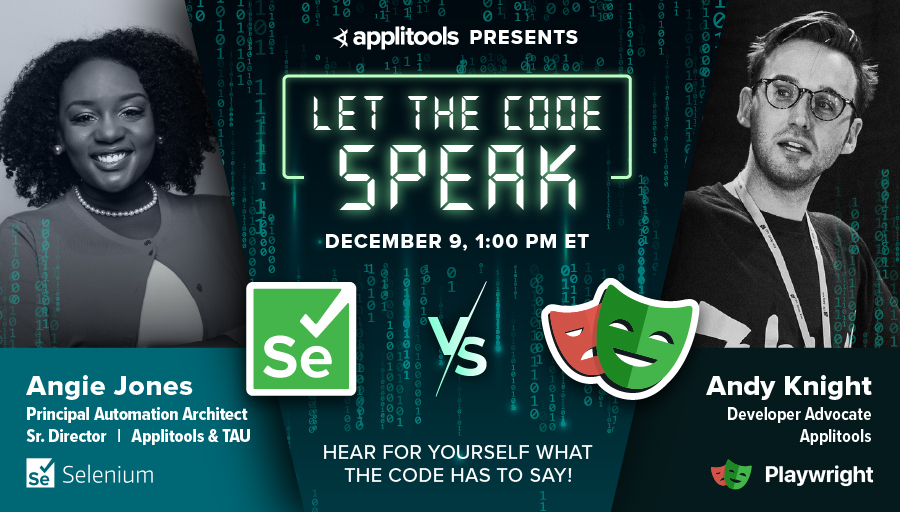

**WARNING: UPDATE THIS BANNER!**

# Cypress versus Playwright: Let the Code Speak!

This repository holds the code from the Applitools webinar,
**Cypress versus Playwright: Let the Code Speak!**

## The battle

Ding Ding Ding!!! We’re back for another epic match-up between test automation frameworks!

🥊 In this corner, we have [Cypress](https://www.cypress.io/) –
the darling test framework of JavaScript frontend development!
*Representing Cypress will be [Filip Hric](https://twitter.com/filip_hric), QA lead at Slido and Cypress Ambassador.*

🥊 And in this corner, we have [Playwright](https://playwright.dev/) –
the insurgent challenger on the testing scene, and the defending champion from our last match-up against Selenium!
*Representing Playwright will be [Pandy Knight](https://twitter.com/AutomationPanda), Automation Panda and Developer Advocate at Applitools.*

In the past few years, Cypress and Playwright have become major contenders for market share, and it’s no surprise why.
Both frameworks have helpful features like automatic waiting, cross-browser support, and thorough tracing.

However, each has its own distinctive edge.
Cypress aims for an intuitive visual experience with its browser window,
while Playwright targets speed and multi-language support.

Rather than compile lists of feature comparisons, this match-up will be a battle of the code!
Round for round, Filip and Pandy will implement small coding challenges in JavaScript using Cypress and Playwright respectively,
and then they will compare and contrast their solutions.

After each round, YOU, the audience, will judge the winner!

Join them and hear for yourself what the code has to say!

## The Cypress code

TBD - put under a folder named `cypress`

## The Playwright code

TBD - put under a folder named `playwright`
